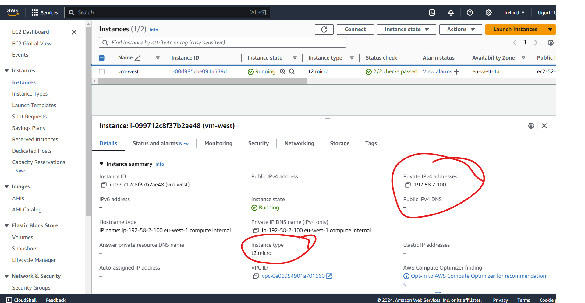
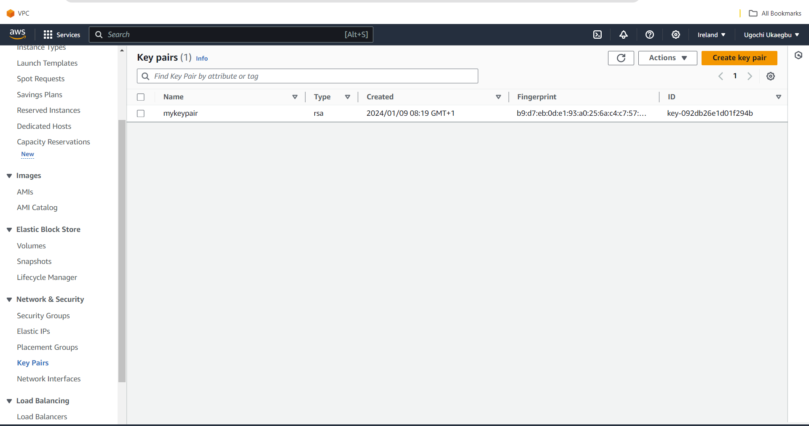

# PROJECT OVERVIEW

Below is a brief description of the content of each directory. 

## CHILD MODULES
This directory contains sub-directories called **EC2_Instance** and **Network**.

### EC2-INSTANCE
This directory contains the main configuration file **(main.tf)**, the **variable.tf** file that accepts inputs that will be passed to the main.tf, and the **output.tf** file that is used to output the value of a resource block.

### Network 
This directory contains a main.tf file and variable.tf file is similar to EC2Instance but differs in that it has **data.tf** file which is used to query aws infrastructure so we can know the available availability_zones and attach each subnet to each availability zone.

## DEVELOPMENT & PRODUCTION
These are different environment that host the root modules. The root modules call the child modules before the infrastructure can be created. The two files in each of these environment are:
  - root-modules.tf
  - provider.tf
The provider.tf specifies the region and the provider where I want to create the infrastructure. In this case it was AWS, while the root modules specifies the values that will be passed as inputs in the variable.tf file in the child modules and later called upon by the main.tf in the EC2-Instance and network.

# STAGES OF EXECUTION
*The first stage was to create the directories specifying root-modules iin the different environment and child modules because the scripts had to be modularized.*

*The second stage was to create a vpc for the various environments. This required:*
- creating a vpc and attaching a cidr block.
- creating an internet gateway and attaching it to the vpc.
- creating a public and private subnet in different availability zones.
- creating route tables for the public subnet.
- associating the public subnet with the internet gateway.

*The third step was to create an ec2 and the step by step process involved were:*
- giving the ec2 a name.
- selecting an ami image. In this case(ubuntu)
- selecting an instance type. (In this case t2.micro)
- creating a key pair.
- editing the network settings like:
      
      - attaching it to a subnet
      - auto assigning a public IP to the instance that was attached to the public subnet.
      - creating a security group(setting the inbound and outbound rules)
- inputting different lines of code to install ansible and docker in the user section.

## Images of resources created in eu-west-1
### vpc image

### Internet gateway
*Internet gateway attached to the vpc*

### Subnets Image 
*Public subnet Image showing the cidr block and availability zone attached to it*

*Private subnet Image showing the cidr block and availability zone attached to it*

### Images of route tables
*Route tables were created and associated with the public subnet*.

*Routes were created to attach the public subnet to the internet gateway*.

Note: You can associate the private subnet to the route table but you would have to attach it to a nat gateway so the private servers can receive request from the internet.

## Images of resources created in eu-central-1
### vpc image

### Internet gateway
*Internet gateway attached to the vpc*

### Subnets Image 
*Public subnet Image showing the cidr block and availability zone attached to it*

*Private subnet Image showing the cidr block and availability zone attached to it*

### Images of route tables
*Route tables were created and associated with the public subnet*.

*Routes were created to attach the public subnet to the internet gateway*.

Note: You can associate the private subnet to the route table but you would have to attach it to a nat gateway so the private servers can receive request from the internet

## Images of ec2 created in eu-west-1
*ec2 image showing the private server ip and instance type*.

*Ec2 image showing the private server ip, instance type and the public ip assigned by AWS*.

## Images of the ec2 created in eu-central-1
*Ec2 image showing the private server ip and instance type*.

*Ec2 image showing the private server ip, instance type and the public ip assigned by AWS*.

## Image of the key in eu-west-1 and eu-central-1
*Key-pair created to enable ssh into the instances*.

## Image of the security group in eu-west-1
*Security group image showing the inbounds rules for http(80) and ssh(22) for IpV4 address*.

## Image of the security group in eu-central-1
*Security group image showing the inbounds rules for http(80) and ssh(22) for IpV4 address*.

## Images of docker and ansible installed on the ec2 in eu-west-1
*Image showing the version of ansible and docker installed*.

## Images of docker and ansible installed on the ec2 in eu-central-1
*Image showing the version of ansible and docker installed*.

# PROCESS OF DEPLOYMENT
To deploy this infrastructure, you will need an AWS account and the necessary permissions set up.
You can use the following commands:
- `terraform init` to initialise your infrastructure.
- `terraform plan` to review and verify your configuration.
- `terraform apply` to deploy your infrastructure
- `terraform destroy` to destroy your infrastructure.

You also need to create a `tfvars.tf` file to create your own values for the variables specified in the root-modules.tf if you decide to deploy this script.

To run the following commands right click on production and development directory and open with a terminal. Note: Do it one after the other.

